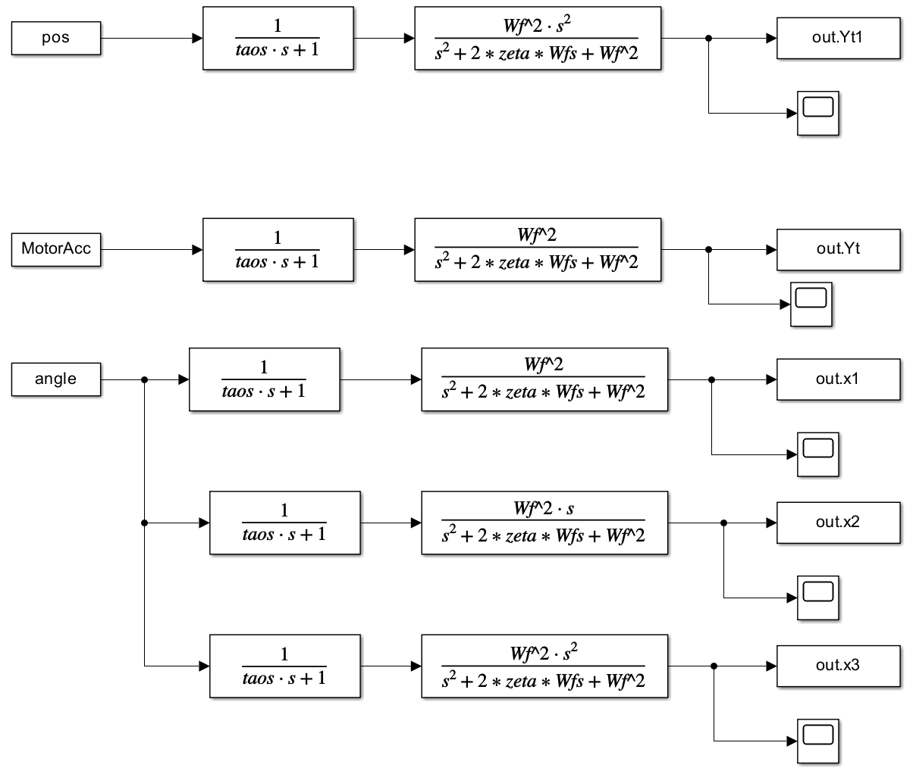
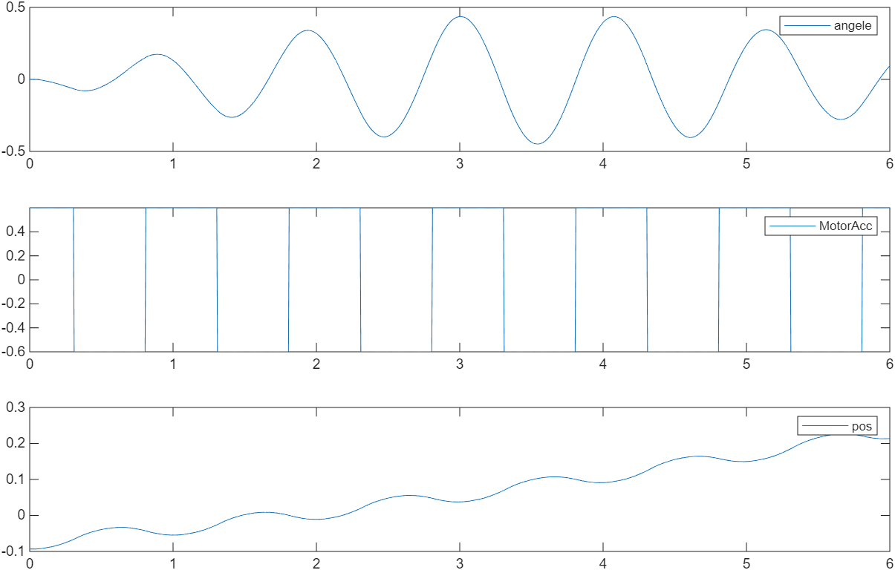
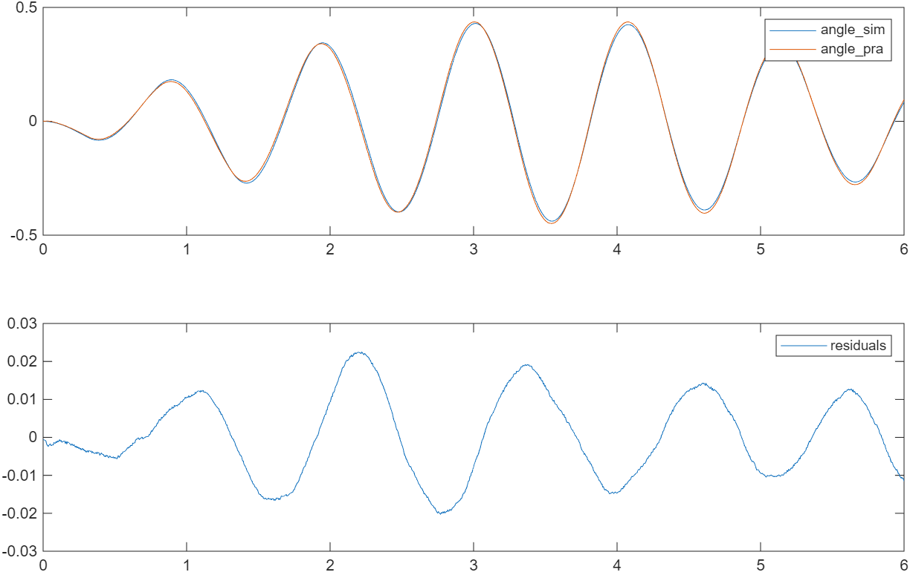
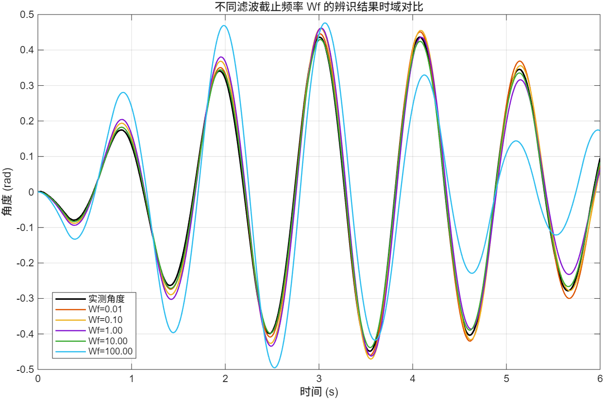
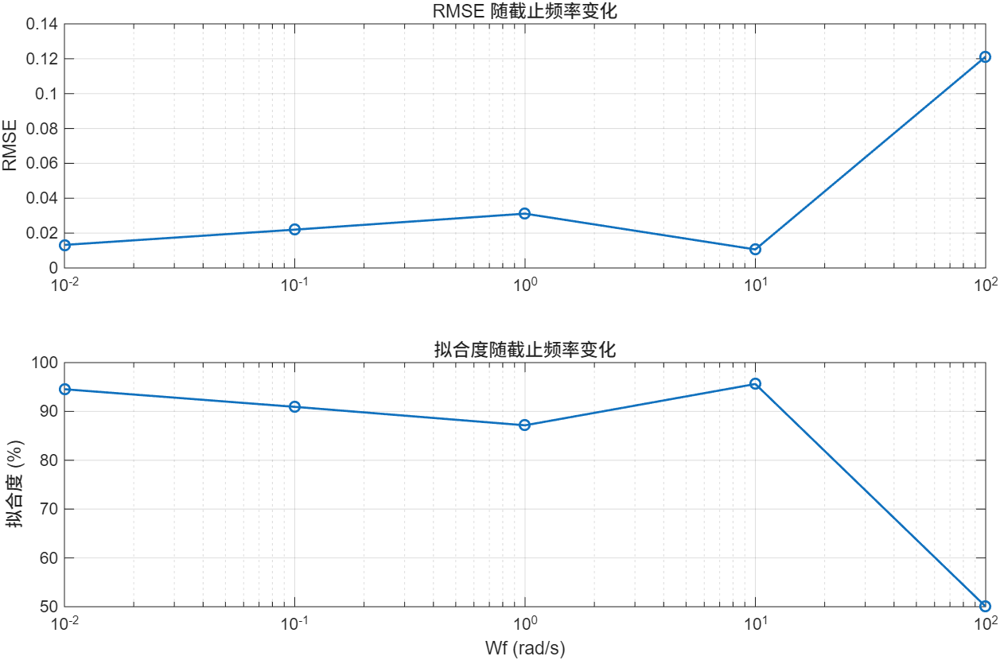
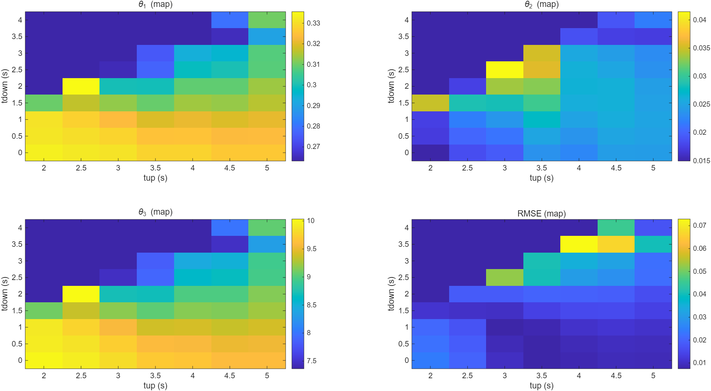
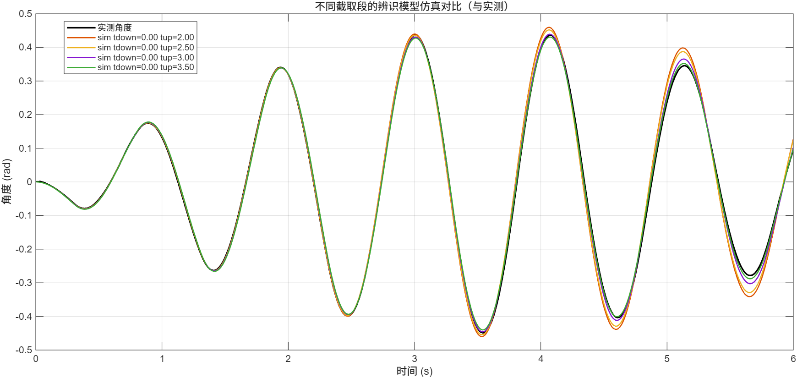
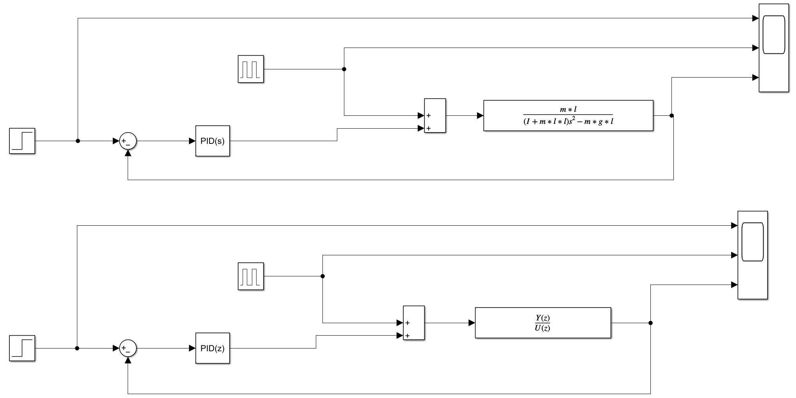
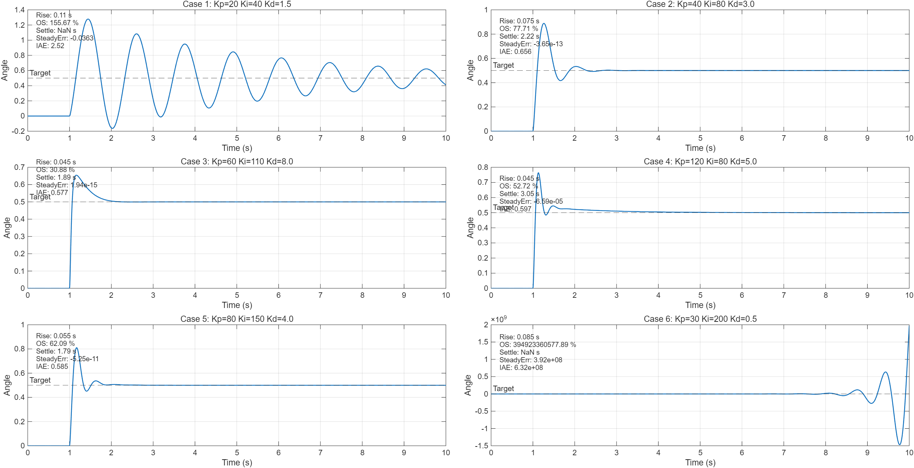

# <center>实验三 顺摆系统辨识实验</center>

## 一、实验目的

​	掌握系统辨识和参数估计的方法，设计利用实验建模获得系统模型和未知参数的方法。

## 二、实验原理

### 倒立摆时域模型

$\frac{J+ml^2}{ml}\ddot\varphi+\frac{c_r}{ml}\dot\varphi+g\varphi=-\ddot x$

### 频域模型

$G(s)=-\frac{mls^2}{(J+ml^2)s^2+c_rs+gml}$

### 辨识方法

$y(t) = −\ddot x, \varphi_𝑀(t)^𝑇 = [\ddot \varphi,\dot \varphi,\varphi], \theta = [ \frac{J+ ml^2}{ml}, \frac{c_r}{ml} , g]^𝑇$

$\theta = (\varphi_𝑀(t)^T\varphi_𝑀(t))^{-1} \varphi_𝑀(t)^Ty(t)$

## 三、实验测试

### 系统辨识MATLAB源代码

```matlab
%% 辨识
clear;
clc;
close all;

%% 
% data=load ('实测数据.txt');
taos=0.005;%角频率
zeta=0.9;%角阻尼
Wf=10;
dt=0.005;%采样时间
tdown=1;
tup=5;
time=6;

data=load ('实测数据.txt');
angle_data=(data(1:time/dt+1,1)+180)/180*pi;
pos_data=data(1:time/dt+1,2)/1000;
MotorAcc_data=data(1:time/dt+1,5);
len=size(angle_data,1);
t=0:dt:dt*(len-1);
      
MotorAcc=[t',MotorAcc_data];
angle=[t',angle_data];
pos=[t',pos_data];

%滤波
out=sim('Filter.slx');

%取出一段数据进行辨识
for k=tdown/dt+1:tup/dt+1
    MotorAcc_F(k-tdown/dt) = -out.Yt(k);%加速度滤波得到的加速度
    angle_F(k-tdown/dt) = out.x1(k);%滤波之后的角度
    angledot_F(k-tdown/dt) = out.x2(k);%滤波之后的角速度
    angleddot_F(k-tdown/dt) = out.x3(k);%滤波之后的角加速度
end
% 最小二乘法公式
phi_M = [angleddot_F' angledot_F' angle_F'];
theta = inv(phi_M'*phi_M)*phi_M'*MotorAcc_F';  %三个参数的辨识结果
Gs=tf(-1,[theta(1) theta(2) theta(3)]);
```

### Simulink滤波文件



### 实测数据



## 四、模型验证

### 1. 时域模型辨识

taos=0.005, zeta=0.9, Wf=10, tdown=1, tup=5时



### 2. 保持输入激励相同，改变滤波截止频率





||$θ_1$| $θ_2$ |$θ_3$|
| -------- | ----------| ------- | -- |
|$W_f=0.01$| 0.3225 |0.01234|9.524|
|$W_f=0.10$|0.3042|0.01433|8.897|
|$W_f=1.00$|0.2866|0.02496|8.264|
|$W_f=10.0$|0.3206|0.02502|9.408|
|$W_f=100$|0.2066|0.04327|5.467|

### 3. 保持输入激励相同，改变数据截取



## 五、实验结果

### 1. 辨识结果

​	通过MATLAB进行时域模型的最小二乘估计，辨识结果与实测数据接近，残差基本在0.02rad（1.15°）以内。

### 2. 滤波截止频率的影响

​	从辨识结果对比图中看出，$W_f$过大时，辨识结果与实测数据差别较大；从辨识参数结果表中看出，$\theta_2$即$c_r$有随$W_f$增大而增大的趋势，$W_f$过小时，$\theta_2$很小，产生阻尼项的失真，但在辨识结果对比图中没有较大的影响。

### 3. 数据截取的影响

​	RMSE 最小值 0.00749，对应 $t_{down}=1.00 s, t_{up}=3.00 s,\theta = [0.323796, 0.023782, 9.57037]$

​	数据段过短时，方程条件数差、信息量不足，辨识结果不佳；包含开始阶段时，激励丰富但含有非线性、初始误差；包含中间阶段时，系统较为稳定，信噪较高，参数更准确。

# <center>实验四 基于传递函数的倒立摆系统平衡控制</center>

## 一、实验目的

1. 掌握PID控制原理，了解每个控制系数的作用。
2. 掌握基于系统传递函数模型，极点配置方法设计倒立摆系统的平衡控制器。
3. 通过仿真分析和对实验测试实验结果的观察与分析，验证所设计控制器的有效性。

## 二、实验任务要求

​	基于传递函数模型设计倒立摆平衡控制器，使得校正后系统的要求如下：

​	调整时间$t_s\leqslant0.5s$

​	最大超调量$M_p\leqslant10\%$

## 三、实验原理

### 1. PID控制器结构

$C(s)=K_p+\frac{K_i}{s}+\frac{K_ds}{\tau_Ds+1}$

### 2. 倒立摆闭环控制系统模型


### 3. 极点配置方法

根据系统校正要求以及以下公式

$M_p=e^{-\frac{\xi\pi}{\sqrt{1-\xi^2}}}$

$t_s=\frac{4}{\xi\omega_n}(\pm2\%)$

计算出阻尼比$\xi_{min}=\sqrt{\frac1{{\frac\pi {ln(10)}}^2 + 1}}$以及自振荡频率$\omega_n$

两个主导极点$s_{1,2}=-\xi\omega_n\pm j\omega_n \sqrt{1-\xi^2}$

剩余的两个极点$s_{3,4}$需要远离主导极点，一般为5~10倍主导极点大小

## 四、仿真测试


Simulink控制系统仿真结构



### 1. 经验法



性能指标：
| Name  |  Kp  |  Ki  |  Kd  | RiseTime (s) | Overshoot (%) | SettlingTime (s) | SteadyError |
| :---- | :--: | :--: | :--: | :----------: | :-----------: | :--------------: | :---------: |
| Case1 |  20  |  40  | 1.5  |     0.11     |    155.67     |       NaN        |  -0.036328  |
| Case2 |  40  |  80  | 3.0  |    0.075     |    77.707     |       2.22       | -3.6515e-13 |
| Case3 |  60  | 110  | 8.0  |    0.045     |    30.883     |       1.89       | 1.9429e-15  |
| Case4 | 120  |  80  | 5.0  |    0.045     |    52.723     |       3.05       | -6.5931e-05 |
| Case5 |  80  | 150  | 4.0  |    0.055     |    62.091     |       1.79       | -5.2491e-11 |
| Case6 |  30  | 200  | 0.5  |    0.085     |  3.9492e+11   |       NaN        | 3.9216e+08  |

PID参数作用：

下面给出在典型二阶/受控系统里你会看到的规律——你的仿真结果用上面的脚本跑一遍能直接验证这些点。

**比例项 Kp（P）**

- 主要效果：提高系统增益，**加快响应、减小上升时间**。
- 副作用：Kp 太大会导致**超调和振荡**；对稳态误差只部分减小（若无积分仍存在稳态误差）。

**积分项 Ki（I）**

- 主要效果：消除稳态误差（把稳态误差逼近 0）。
- 副作用：引入相位滞后，**可能使系统变慢并增加超调/振荡**；Ki 过大会导致积分饱和或较大的振荡/不稳定。
- 经验：把 Ki 逐步调大直到稳态误差可以接受，但同时观察是否引入过多超调或延长稳定时间。

**微分项 Kd（D）**

- 主要效果：预测误差变化，**抑制超调、减小振荡、提高阻尼**（改善瞬态响应）。
- 副作用：对高频噪声敏感（故常在微分项后加滤波，tauD），tauD 太小会放大噪声导致控制器不稳定或抖动。
- 经验：在 Kp 较高或 Ki 引起超调时，加入适量 Kd 可改善稳定性并减少超调。

### 2. 极点配置法

## 五、实验测试


## 六、实验结果

## 七、实验思考

## 实验任务


完成如下内容：

2． 经验法调整PID参数并仿真：采用经验法实验调节PID控制参数实现倒立摆的平衡控制，记录控制器参数，在Simulink中仿真系统的闭环控制效果，记录小车位移、小车加速度、摆杆角度的时间响应，分析仿真中系统达到的性能指标以及P、I、D三个参数的作用。

图4-2 PID校正仿真

3． 极点配置法配PID参数并仿真：根据期望性能指标，针对倒立摆系统模型，采用极点配置方法计算控制器参数，并在Simulink中仿真分析系统的闭环控制效果，记录小车位移、小车加速度、摆杆角度的时间响应。

4． 实测：使用仿真得到的PID参数进行实测，实验测试闭环系统的控制效果，记录数据结果

5． 分析研究：分析不同期望极点等情况下的倒立摆平衡控制结果。

表 4‑1 仿真、实测数据记录

|                      | 仿真                                                       | 实测 |
| -------------------- | ---------------------------------------------------------- | ---- |
| 主极点1，非主导极点1 |                                                            |      |
| ……                   | ……                                                         | ……   |
| 主极点n，非主导极点n |                                                            |      |
| 分析研究             | 比较实验结果与仿真结果，分析不同期望极点对系统性能的影响。 |      |

表 4‑2实验要求列表

| **内容名称** | **详细描述**                                                 |
| ------------ | ------------------------------------------------------------ |
|              |                                                              |
|              | 给出Matlab源代码和Simulink仿真模型：  1）经验法确定PID控制器参数，仿真分析系统达到的性能指标以及P、I、D三个参数的作用，  2）采用极点配置方法设计的PID控制器，建立倒立摆闭环控制系统的模型，仿真分析系统的闭环控制效果，记录小车位移、小车加速度、摆杆角度的时间响应，分析仿真中系统达到的性能指标，  2）测试不同期望极点和有无干扰对控制性能的影响。 |
|              | 1） 使用经验法确定的PID控制器参数，实现倒立摆平衡控制，  2） 采用所设计的极点配置PID控制器，测试实际的倒立摆控制系统，记录小车位移、摆杆转角、小车加速度的时间响应，分析实验系统获得的性能指标是否符合期望要求（仿真2内容实测），  3） 测试不同期望极点和不同干扰下的实际控制效果（仿真4内容实测）。 |
| 分析研究     | 比较实验结果与仿真结果，分析干扰信号和期望极点对系统性能的影响。 |
| 实验思考     | 倒立摆闭环控制中，小车位移能否稳定在某一值？                 |

 